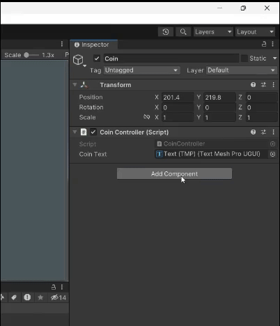

# Game Event v1 Tutorial

This system is made by "This is GameDev" youtube channel. Here are some references we used in this event system.
- Tutorial video : https://www.youtube.com/watch?v=7_dyDmF0Ktw
- Implementation code : https://www.gamedev.lu/game-assets

## Cara Kerja Game Event
Cara kerja dari sistem _game event_ ini seperti siaran radio. Stasiun radio akan menyiarkan siarannya tanpa perlu tahu siapa yang akan mendengarkannya. Pendengar radio akan mendengarkan siarannya tanpa perlu tahu dari mana siaran itu berasal.
Pada pemrograman berorientasi objek, prinsip ini umumnya dikenal sebagai _design pattern "Publish Subscribe" (PubSub)_, di mana ada satu _publisher_ yang akan mengirimkan _event_ dan beberapa _subscriber_ yang akan menunggu _event_ tersebut dikirimkan.
Kadang, _design pattern_ ini juga disebut sebagai _observer_

## Penggunaan Sistem Game Event pada Projek Ini
Sebenarnya, Unity sudah menyediakan `UnityEvent` untuk memudahkan _developer_-nya dalam mengimplementasikan _pubsub_. Sistem ini merupakan pengembangan lebih lanjut dari `UnityEvent`, sehingga implementasinya akan jauh lebih mudah.

Terdapat dua buah _script_ penting, yaitu:
1. [`GameEvent.cs`](https://github.com/Farizside/The-After-Before/blob/gameevent/Assets/Scripts/Game%20Event/v1/GameEvent.cs), sebagai _event_ yang akan menjadi peran utama dalam implementasi sistem ini, dan
2. [`GameEventListener.cs`](https://github.com/Farizside/The-After-Before/blob/gameevent/Assets/Scripts/Game%20Event/v1/GameEventListener.cs), _script_ yang akan digunakan pada _subscriber_ dari suatu _event_.

Langkah-langkah penggunaan:
1. Pastikan kedua _script_ di atas sudah ada pada projek Unity.
2. Pastikan sudah ada _event_ yang akan digunakan pada folder `Assets/Game Events`.
   - Jika belum ada, buat _event_ tersebut dengan cara klik (+) > GameEvent
   - 
3. Pada _publisher_, buat _script_ berikut untuk mengirimkan _event_ tersebut

```
public GameEvent Event1;

void PublishEvent(GameEvent event, object data){
  ... // some code before publishing
  Event1.Raise(data);
  ... // some code after publishing
}
```
  Perlu dicatat bahwa _event_ yang ingin digunakan perlu dimasukkan melalui _inspector_.
  
4. Pada _subscriber_, buat _script_ berikut untuk mendengarkan _event_ tersebut
```
    public void ListenEvent(Component sender, object data)
    {
        if (sender is Publisher && data is int)
        {
            ... // some code for subscriber while event is raised by publisher
        }
    }
```
  Perlu dicatat bahwa kode tersebut mengecek apakah pengirim _event_ merupakan kelas `Publisher` dan data yang dikirimkan merupakan `int`. Sesuaikan dengan kebutuhan.
  
5. Terakhir, tambahkan komponen `GameEventListener` pada subscriber.
  - Pada _field_ `Game Event`, _drag and drop event_ yang ingin digunakan ke _field_ ini
  - Pada _field_ `Response(Component, Object)`
    - Klik (+), lalu pilih `Runtime Only`.
    - Di bawahnya, pilih/_drag and drop_ _game object publisher_
    - Di sebelah kanannya, pilih `<Nama script> => <Nama method>` (dalam kasus ini, nama _method_-nya ialah `ListenEvent`)
  


## Contoh
Contoh dari implementasi sistem ini dapat dilihat pada _scene_ `GameEventTesting.unity`

